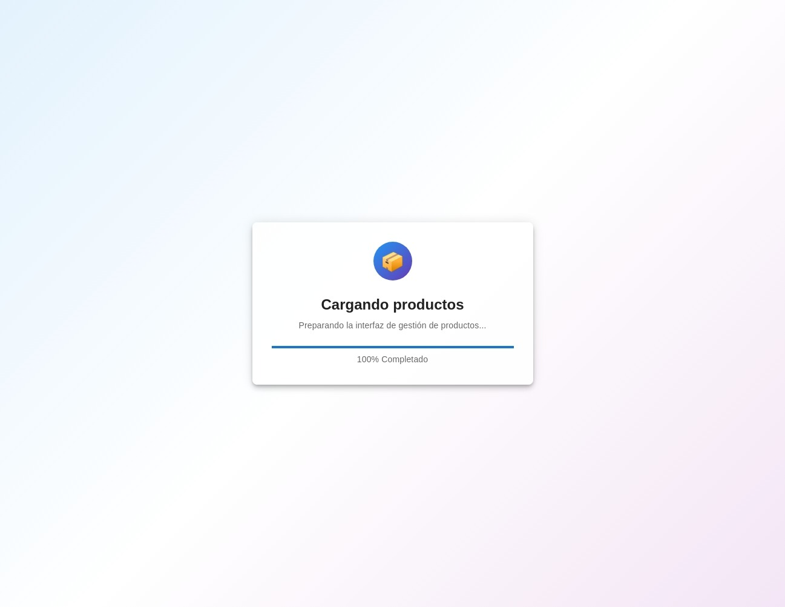
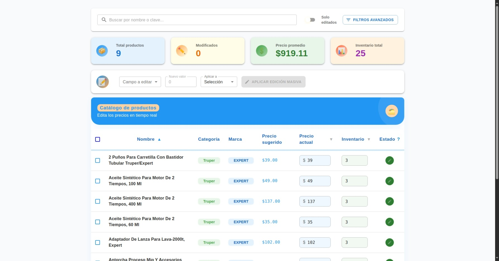
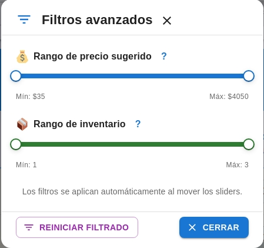
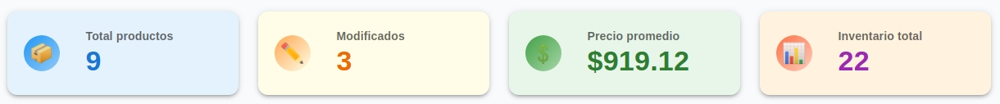
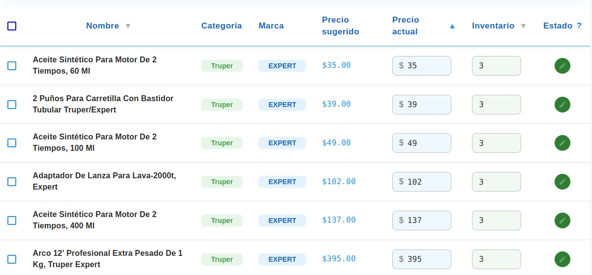
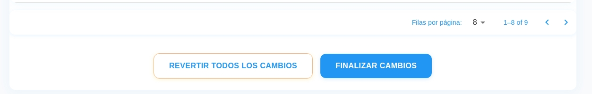
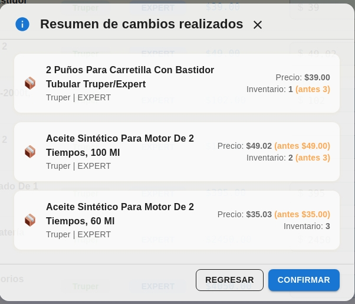
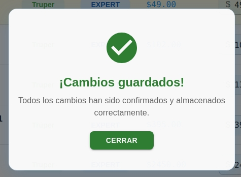

# 🛠️ Kladi Ferretería - Gestión de Catálogo Inicial

---

## 🧱 FASE 1: ESTRUCTURA DEL PROYECTO

### ✅ Tecnologías y herramientas sugeridas

- **Frontend:** React + TypeScript
- **Framework de UI:** Material UI
- **Gestión de estado:** Context API
- **Consumo de API:** Axios
- **Routing:** React Router DOM
- **Build:** Vite
- **Formateo y Lint:** Prettier + ESLint

**Extras (puntos extra):**

<!-- - SSR con Next.js  -->

- Deploy en Netlify
- Pruebas unitarias con Vitest

---

## 🧩 FASE 2: CONSUMO DE LA API

- 🌐 API externa: Se consume el catálogo de productos desde una API abierta de Kladi.

---

## 🎨 FASE 3: UI DE VISUALIZACIÓN Y EDICIÓN

### ✏️ Componentes clave

- **ProductTable** con campos editables (precio e inventario)
- **Filtros:** por texto, rango de precio, estado de inventario
- **Botones:** restaurar precios, finalizar

### 🧮 Lógica clave

- Comparar `precio_actual !== precio_sugerido` o `inventario_actual !== inventario_original` para saber si fue modificado.
- Campo editable con validación numérica.

---

## ✅ FASE 4: PANTALLA DE RESUMEN Y GUARDADO

### 📋 Mostrar

- Lista de productos modificados
- Total de productos modificados
- Suma del inventario

### 🧩 Funcionalidad

- Botón "Guardar cambios": muestra modal de éxito.
- Botón "Regresar": vuelve a pantalla de edición.

---

## 🧪 FASE 5: MEJORAS Y ENVÍO

### 🏅 Puntos extra

- ✅ SSR con Next.js
- ✅ Columna y filtro por categoría
- ✅ Modificación por grupos
- ✅ Marca visual de productos editados
- ✅ Pruebas unitarias

### 📤 Deploy y envío

- Publicar en GitHub y desplegar en Netlify.
- Incluir README con:
    - Descripción
    - Instrucciones de instalación
    - Justificación de decisiones técnicas
    - Capturas de pantalla

---

## ✨ Funcionalidades principales

- Visualización de catálogo con campos editables (`precio` e `inventario`)
- Filtro de productos por nombre o clave
- Filtros por rango de precio y estado de inventario
- Restauración de precios sugeridos
- Detección de productos modificados (precio/inventario editado)
- Pantalla de resumen con lista de productos modificados
- Modal de éxito al guardar cambios
- Navegación entre vista de edición y resumen

---

## 🧑‍💻 Tecnologías utilizadas

- ⚛️ **React** + **TypeScript**
- 🎨 [Material UI (MUI)](https://mui.com/)
- 🌐 [Axios](https://axios-http.com/) – Consumo de API externa
- ⚡ [Vite](https://vitejs.dev/) – Entorno de desarrollo rápido
- 🧠 **React Context API** – Para estado global
- 🧪 ESLint + Prettier – Buenas prácticas de código

---

## 📁 Estructura del Proyecto

```
kladi-ferreteria/
├── public/
│   └── index.html
├── src/
│   ├── __tests__/
│   │   ├── ProductTable.test.tsx  # Pruebas unitarias de la tabla
│   │   ├── EditProducts.test.tsx # Pruebas unitarias de filtros
│   │   ├── MassEditPanel.test.tsx # Pruebas unitarias de la barra de edición masiva
│   │   └── ProductSummaryPanel.test.tsx   # Pruebas unitarias del modal
│   ├── api/
│   │   └── kladiApi.ts         # Cliente Axios para API de Kladi
│   ├── adapters/
│   │   └── productAdapters.ts   # Sanitización de datos de productos
│   ├── components/
│   │   ├── ProductTable.tsx    # Tabla editable de productos
│   │   ├── MassEditPanel.tsx  # Barra de edición masiva
│   │   └── ProductSummaryPanel.tsx    # Modal de éxito tras guardar
│   ├── context/
│   │   └── ProductContext.tsx  # Estado global de productos
│   ├── hooks/
│   │   ├── useProductFilters.ts # Hook para acceder al contexto de filtros de productos
│   │   ├── useProductSummary.ts # Hook para acceder al contexto de resumen de productos
│   │   └── useMassEdit.ts       # Hook para acceder al contexto de edición masiva
│   ├── pages/
│   │   ├── EditProducts.tsx    # Pantalla principal (edición)
│   ├── types/
│   │   └── Product.ts          # Tipado del modelo de producto
│   ├── utils/
│   │   └── randomint.ts        # Generador de números aleatorios
│   ├── App.tsx                 # Rutas y layout
│   ├── main.tsx                # Entrada principal + Theme MUI
│   └── ...
├── .eslintrc.json              # Configuración ESLint (4 espacios)
├── .prettierrc                 # Configuración Prettier (4 espacios)
├── package.json
├── tsconfig.json
├── vite.config.ts
└── README.md
```

---

## 🚀 Instalación y uso local

### 1. Clona el repositorio

```bash
git clone https://github.com/Andrik0711/kladi-reto.git
cd kladi-reto
```

### 2. Instala Material UI (MUI) y otras dependencias

```bash
npm install @mui/material @emotion/react @emotion/styled
npm install @mui/icons-material
npm install axios react-router-dom
```

### 2. Instala las dependencias

```bash
npm install
```

### 3. Instala ESLint y Prettier (opcional pero recomendado)

```bash
npm install --save-dev eslint prettier eslint-config-prettier eslint-plugin-react eslint-plugin-react-hooks @typescript-eslint/eslint-plugin @typescript-eslint/parser
```

### 4. Scripts útiles

- `npm run lint` — Ejecuta ESLint sobre el código fuente
- `npm run format` — Formatea el código con Prettier

### 5. Inicia el servidor de desarrollo

```bash
npm run dev
```

### 6. Abre la app en tu navegador

[http://localhost:5173](http://localhost:5173)

---

## 📌 Consideraciones Técnicas

- Se utiliza el API abierto de Kladi para poblar productos:  
  https://catalogo-kladi.dev.rombo.microsipnube.com

- Los productos se enriquecen en frontend con campos auxiliares como `precio_actual`, `inventario_actual`, `inventario_original` y `modificado`.

- La detección de cambios se basa en comparar `precio_actual` con `precio_sugerido` e `inventario_actual` con `inventario_original`.

---

## 🧪 Pruebas

El proyecto incluye pruebas unitarias automáticas usando [Vitest](https://vitest.dev/) y [Testing Library](https://testing-library.com/).

### Ejecutar pruebas

```bash
npm run test         # Ejecuta todas las pruebas en modo consola
npm run test:ui      # Ejecuta las pruebas en modo interactivo (UI)
```

Los archivos de prueba se encuentran en `src/__tests__/` para mantener una arquitectura limpia y escalable.

---

### Capturas de pantalla

#### Pantalla de carga


#### Pantalla de principal


#### Pantalla de filtros


#### Pantalla de modal de filtros Avanzados


#### Pantalla de información de productos


#### Pantalla de edición de productos masiva


#### Pantalla de tabla de productos


#### Pantalla de botones de acción


#### Pantalla de resumen de productos modificados


#### Pantalla de modal de éxito


#### Diagrama de flujo del camino del usuario

```mermaid
    A[Inicio: Pantalla de carga] --> B[Pantalla principal: Visualización de productos]
    B --> C[Filtros y búsqueda de productos]
    C --> D[Edición individual o masiva de precio/inventario]
    D --> E[Marca visual de productos editados]
    E --> F[Botón: Finalizar/Guardar cambios]
    F --> G[Pantalla de resumen de productos modificados]
    G --> H[Confirmar y guardar cambios]
    H --> I[Modal de éxito]
    I --> J[Regresar a pantalla principal]
```

---
### Producción
Para desplegar la aplicación en producción, se utilizo Netlify. El sitio está disponible en:
[https://kladi-reto-tecnico.netlify.app](https://kladi-reto-tecnico.netlify.app)

--- 
### Justificación de decisiones técnicas y relación con las pantallas

- **Pantalla de carga:** Implementada para mejorar la experiencia del usuario, para que no se vea una tabla vacía mientras se cargan los productos desde la API.

- **Pantalla principal y tabla de productos:** Permite visualizar y editar productos de forma eficiente.

- **Pantallas de filtros y modal de filtros avanzados:** Mejoran la usabilidad permitiendo búsquedas y segmentación de productos.

- **Pantalla de edición masiva:** Permite modificar precios/inventarios por grupos, agilizando la gestión.

- **Pantalla de botones de acción:** Acciones claras para restaurar, guardar o finalizar cambios.

- **Pantalla de resumen de productos modificados:** Muestra un resumen antes de guardar, ayudando a validar los cambios.

- **Pantalla de modal de éxito:** Feedback inmediato tras guardar cambios, mejorando la satisfacción del usuario.

- **Pruebas unitarias:** Todas las pantallas y funcionalidades están cubiertas con pruebas usando Vitest y Testing Library, asegurando calidad y mantenibilidad.

- **Prettier + ESLint:** Garantizan código limpio y consistente en todos los componentes y pantallas.

- **Despliegue en Netlify:** Permite acceso rápido y confiable a la aplicación, facilitando la revisión de todas las pantallas por cualquier usuario.
---